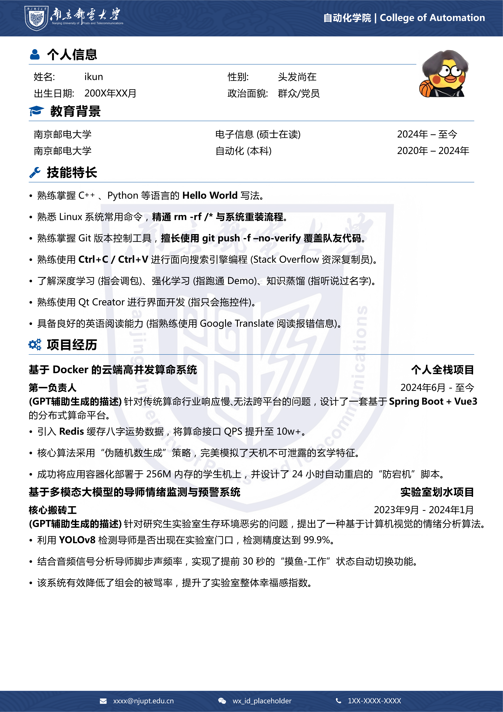

# NJUPT Latex 简历模板

> "只要胆子大，简历写成架构师。" 

这是一个基于 LaTeX 的南京邮电大学（NJUPT）简历模板。Fork 自网络开源项目如https://github.com/LeyuDame/BNUCV/tree/main

** 警告：必须使用 `XeLaTeX` 引擎，且必须编译三次！**

为什么是三次？
1.  第一次：告诉 LaTeX 这是个文档。
2.  第二次：告诉图片它该在哪。
3.  第三次：祈祷排版不要炸。

##  效果预览 (Preview)

  

